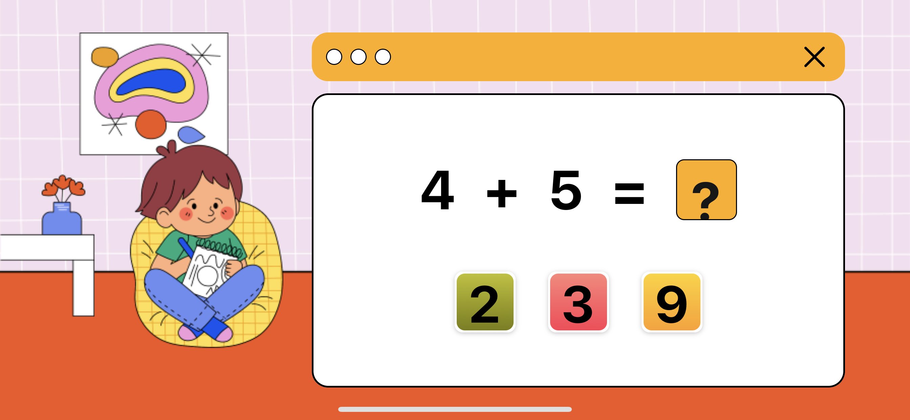
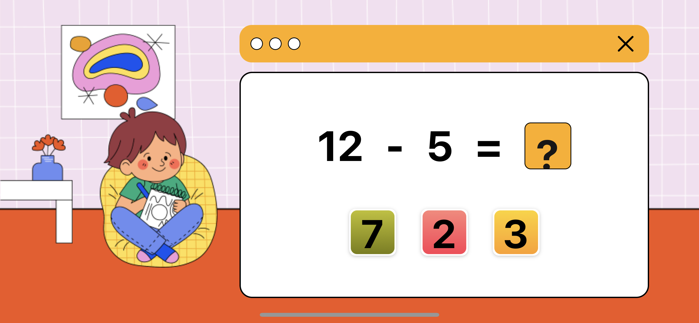
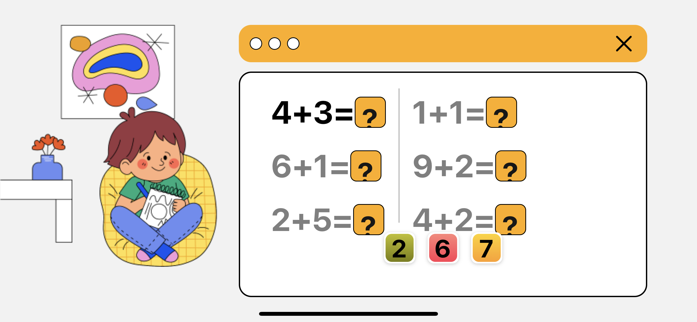
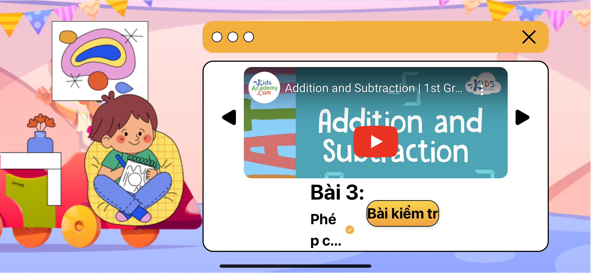
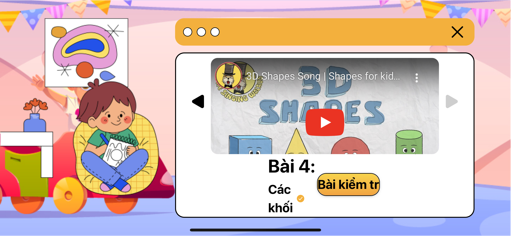

## **Math For Kids App**:
Math For Kids App is an interactive learning tools for elementary students. It is a suitable app to kids because this app teaches kids math in a fun interactive way which helps them in building to become an expert in math.
## **Learning**:

- **Video Lessons**: 4 lessons from youtube in total to learn. Students are allowed to study each topics before the exam including: Shapes, Calculation and Counting. 

## **Practicing**:
- **Counting Numbers**: count the numbers of animals appearing on the screen.

- **Additional and Subtractional calculation**: Multiple numbers of simple calculation to solve.


## **Testing**:
There is an exam in the end of the lesson to test the students ability.



## Run Locally

Clone the project

```bash
  git clone https://github.com/Duc-Nguyen1310/Math-App.git
```

Go to the project directory

```bash
  cd Math-App
```

Install dependencies

```bash
  yarn
```

Start the server

```bash
  yarn start
```


## Demo

Link video demo :https://drive.google.com/file/d/18VDyjEE7jcaSOI2gYAhjf088DLn02M63/view?usp=sharing


## Screenshots






