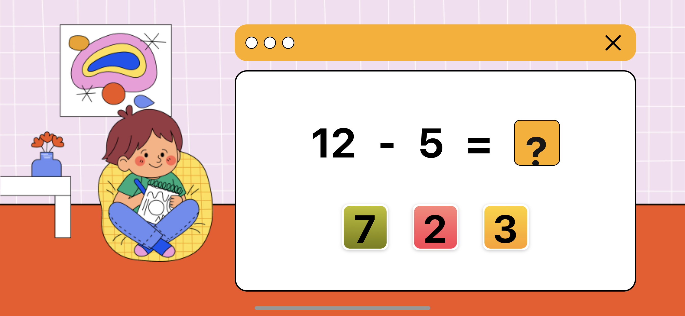

# Project Title

A brief description of what this project does and who it's for


## Run Locally

Clone the project

```bash
  git clone https://github.com/Duc-Nguyen1310/Math-App.git
```

Go to the project directory

```bash
  cd Math-App
```

Install dependencies

```bash
  yarn
```

Start the server

```bash
  yarn start
```


## Demo

Link video demo :https://drive.google.com/file/d/18VDyjEE7jcaSOI2gYAhjf088DLn02M63/view?usp=sharing


## Screenshots



